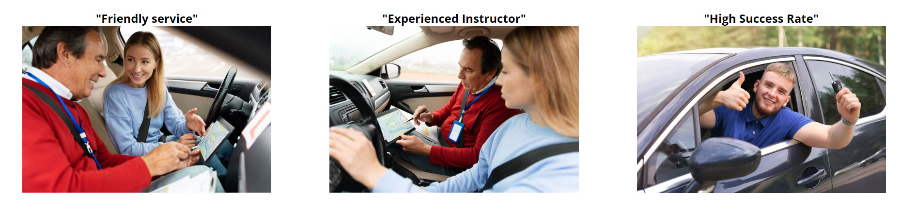
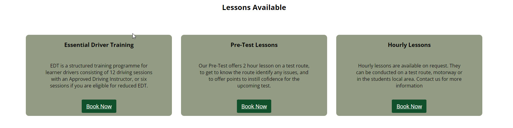
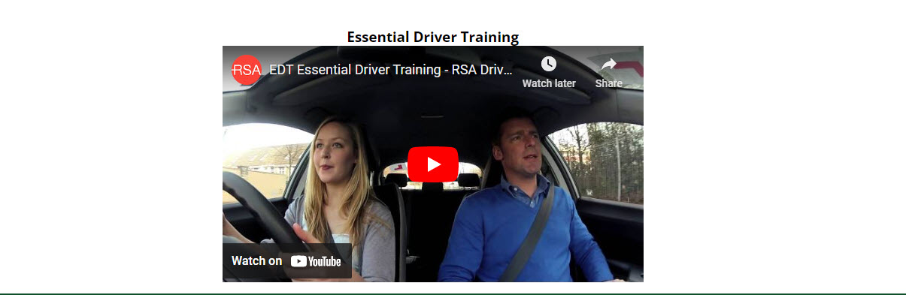
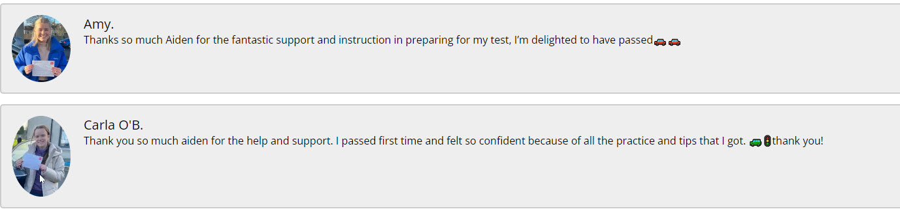
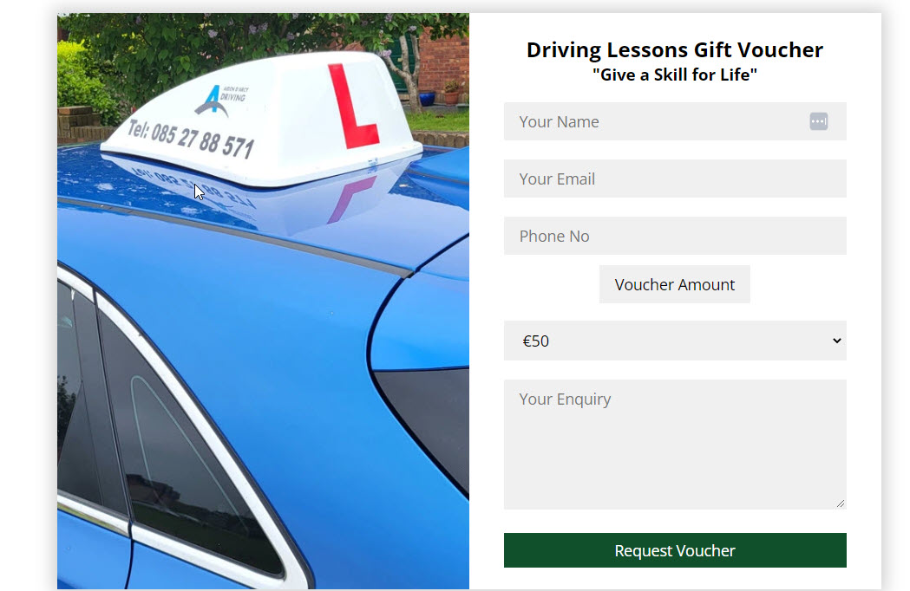
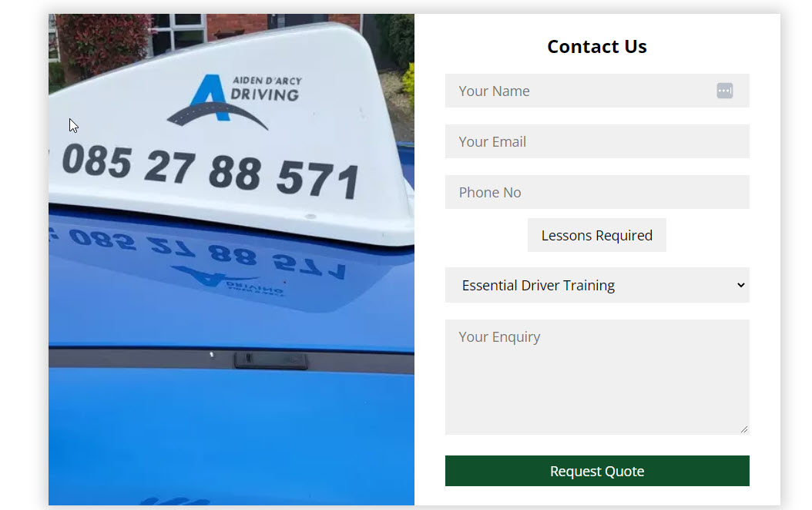

# D'Arcy Driving School

## A website for a Driving School based in East Meath covering the Louth Meath areas of Ireland

### Creator - Patrick Grant

## **[Live site](https://patrickg0308.github.io/design/index.html)**

------------------------------------------------------------------

## **[Repository](https://https://github.com/PatrickG0308/design)**

------------------------------------------------------------------
  
## Table of contents

1. [UX Design](#ux-design)
2. [Features](#features)  
3. [Technology used](#tech)
4. [Testing](#testing)  
6. [Bugs](#bugs)  
7. [Deployment](#deployment)
8. [Credits](#credits)
9. [Content](#content)  
10. [Acknowledgements](#acknowledgements)  

# UX design

## Strategy Plane

### To determine the best approach to this project I started with to determine the user and business needs

## User Stories

### User
>
> As a user I want to be able to find a driving school in my local area.  
> As a user I want to be able to contact the driving school online.  
> As a user I want to be able to book lessons online.  
> As a user I want to be able to read testimonials about the driving school .  
> As a user I want to be able to order a gift voucher.

### Business Owner
>
> As the site owner I want to be able to showcase the lessons available.  
> As the site owner I want to highlight the services on offer.  
> As the site owner I want to create leads and provide students a way to book online and/or request quotes.  
> As the site owner I want to use this website to attract students in the Meath & Louth area.
> As the site owner I want to provide customers the ability to obtain Gift Vouchers.

## Scope Plane
>
> The website should have a Navigation menu that is consistent across all pages and devices.  
> The website should have a information message for the student explaining to them who we are and what we provide and the area we cover.  
> The website should neatly and appropriatly list the lessons we provide to the students.  
> The website should give the student proof of work completed through testimonials.  
> The website should give the student a way to contact the business for quotes or vouchers through a form.  
> The website should give the user more contact methods including phone number, e-mail, instagram page.  

## Structure Plane
>
> To acheieve the goals of the above the website should include at least 5 pages consisting of:  Home, Lessons, Testimonials, Gift Vouchers, Contact.  

**Home Page**
> Navigation with links  
> Welcome message with call to action to take user to contact form through use of Submit Button.  
> Service card section showcasing the services offered.
> Footer section with details of phone number, email and instagram link

**Lessons**
> The lesson page should outline the lessons available to the student.  
> The lesson page should allow for the ability to book a lesson directly under the description.
> The lesson page should also have an informational video on RSA approved EDT lessons.  

**Testimonials**
> The portfolio page should show images of successful students and comments they have made about D'Arcy Driving school.

**Gift Vouchers**
> The Gift Voucher page should allow customers the ability to order a gift voucher through the use of a dropdown menu in a form.  

**Contact**
> The contact page should have a contact form for the student to make an enquiry or request quote.  
> The form should collect contact details for the customer so that the owner can contact them.
> The form should have a dropdown menu offering the choice of lesson available.
> The contact form should give user feedback on submission.

## Features

### index.html

#### Navigation Bar

> Logo on left side with 5 nav links on right with hover styling.

#### Intro

> Intro and image side by side with call to action book now button. This button will take user to contact.html

#### Services Section

> Services showcased through the use of images.

#### Footer

>Contact information for business highlighted in "Traffic light" green.

### lesson.html

#### Lesson Type

>Outline lesson type with description and click to action button which takes user to contact page.

#### EDT Video

>You Tube video outlining EDT training requirements plays in page.

### testim.html

>Testimonials from successfull students

### gift.html

> Collects user data through compulsory fields, offers a choice of amounts through dropdown menu. Upon submission this page is redirected to thankyou.html page for better user experience.

### contact.html

>Main traffic page were all click to action "Book Now" buttons are redirected. Collects data through compulsory fields and offers a dropdown menu with choice of lessons available. Offers an enquiry field for general enquiries.Upon submission the user is redirected to thankyou.html

### thankyou.html

>Submitted requests from gift.html and contact.html will receive this response for better user experience.

# Features Left to Implement

>As a future enhancement, the contact form will be updated with javascript to send an email to D'arcy Driving School with the contact information.

>Add more social media to footer

# Technologies 

* HTML
  * The structure of the Website was developed using HTML as the main language.
* CSS
  * The Website was styled using custom CSS in an external file.
* CodeAnywhere
  * The website was developed using Visual Studio Code IDE <https://app.codeanywhere.com/>
* GitHub
  * Source code is hosted on GitHub and delpoyed using Git Pages.
* Font Awesome
  * Icons obtained from <https://fontawesome.com/> were used as the Social media links in the footer section.
* Tinypng
  * <https://tinypng.com/> was used to reduce the size of the images used throughout the website
* Cloudconvert
  * webp files were created at <https://cloudconvert.com/>
* SimpleImageResizer
  * Resize image files <https://www.simpleimageresizer.com/>
  

