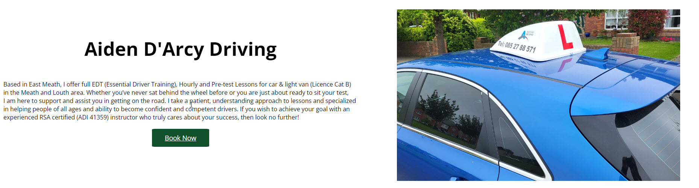
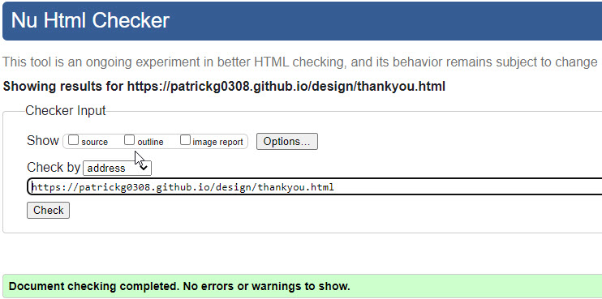

# D'Arcy Driving School

## Website designed for a Driving School based in East Meath covering the Louth Meath areas of Ireland

### Creator - Patrick Grant


## **[Live site](https://patrickg0308.github.io/design/index.html)**

---

## **[Repository](https://github.com/PatrickG0308/design)**

---

## Table of contents

1. [UX Design](#ux-design)
2. [Features](#features)
3. [Features Left](#left)
4. [Technology used](#technologies)
5. [Testing](#testing)
6. [Bugs](#bugs)
7. [Deployment](#deployment)
8. [Credits](#credits)
9. [Content](#content)
10. [Acknowledgements](#acknowledgements)

<a name="ux-design"></a>

# UX design

## Strategy Plane

### To determine the best approach to this project I started with determining the user and business needs for a site

## User

> As a user I want to be able to find a driving school in my local area.  
> As a user I want to be able to contact the driving school online.  
> As a user I want to be able to book lessons online.  
> As a user I want to be able to read testimonials about the driving school and their instructor.  
> As a user I want to have the option to order a gift voucher.

## Business Owner

> As the site owner I want to be able to showcase the lessons available.  
> As the site owner I want to highlight the services on offer.  
> As the site owner I want to create leads and provide students a way to book online and/or request quotes.  
> As the site owner I want to use this website to attract students in the Meath & Louth area.
> As the site owner I want to provide customers the ability to obtain Gift Vouchers.

# Scope Plane

> The website should have a Navigation menu that is consistent across all pages and devices.  
> The website should have a information message for the student explaining to them who we are and what we provide and the area we cover.  
> The website should neatly and appropriatly list and describe the lessons we provide to the students.  
> The website should offer potential students positivity through testimonials.  
> The website should give the student a way to contact the driving school for quotes or vouchers through a form.  
> The website should give the student more contact methods including phone number, e-mail, instagram page.

# Structure Plane

> To acheieve the goals of the above the website should include at least 5 pages consisting of: Home, Lessons, Testimonials, Gift Vouchers, Contact.

**Home Page**

> Navigation with links  
> Welcome message with call to action to take user to contact form through use of Submit Button.  
> Service card section showcasing the services offered.
> Footer section with details of phone number, email and instagram link

**Lessons**

> The lesson page should outline the lessons available to the student.  
> The lesson page should allow for the ability to book a lesson directly under the description.
> The lesson page should also have an informational video on RSA approved EDT lessons.

**Testimonials**

> The testimonial page should show images of successful students and comments they have made about D'Arcy Driving school.

**Gift Vouchers**

> The Gift Voucher page should allow customers the ability to order a gift voucher through the use of a dropdown menu in a form.

**Contact**

> The contact page should have a contact form for the student to make an enquiry or request quote.  
> The form should collect contact details for the customer so that the owner can contact them.
> The form should have a dropdown menu offering the choice of lesson available.
> The contact form should give user feedback on submission.

<a name="features"></a>

# Features

## index.html

#### Navigation Bar


> Contains links to the Home, Lessons, Testimonials, Gift Vouchers, Contact pages and will be responsive on all devices.
> 
> This will allow users to easily navigate between the pages within the site on any size device.

#### Intro



> Intro and image side by side with call to action book now button. This button will take user to contact.html.
>
> This information lets the user know what the site is about.

#### Services Section


> Services showcased through the use of images.
>
> This information will convey to users what type of services are available

#### Footer


> Contact information for business.
>
> This will allow the user to follow `D'Arcy Driving` on social media where they can get more up to date information that may not be displayed on the website. The contact information will allow the user to contact `D'Arcy Driving` directly. All links open seperate tabs to the appropriate
apps.
 
## lesson.html

#### Lesson Type


> Outline lesson type with description and click to action button which takes user to contact page.
>
> This information informs users of the lesson types that are available and the option to `Book Now`

#### EDT Video


> You Tube video outlining EDT training requirements plays in page. Requires user action to play.
>
> Video helping users make an informed decision 

## testim.html


> Testimonials from successfull students
>
> This infomation shows users successful students and their comments about `D'Arcy Driving` 

## gift.html


> Collects user data through compulsory fields, offers a choice of amounts through dropdown menu. Upon submission this page is redirected to thankyou.html page for better user experience.
>
> This form allows users to purchase Gift Vouchers for different denominations.

## contact.html


> Main traffic page were all click to action "Book Now" buttons are redirected. Collects data through compulsory fields and offers a dropdown menu with choice of lessons available. Offers an enquiry field for general enquiries.Upon submission the user is redirected to thankyou.html.
>
> This form allows users to book a lesson, enter a general query or request a quote. A user can request all three if required.

## thankyou.html


> Submitted requests from gift.html and contact.html will receive this response for better user experience.
>
> This infomation confirms to user that their submission to `D'Arcy Driving` has been successful and they will be in touch shortly,

<a name="left"></a>

# Features Left to Implement

> As a future enhancement, the contact form will be updated with javascript to send an email to D'arcy Driving School with the contact information.

> Add more social media to footer

> Use javascript to minimize navlinks to 3 bar setting on responsive screen

<a name="technologies"></a>

# Technologies

- HTML
  - The structure of the Website was developed using HTML as the main language.
- CSS
  - The Website was styled using custom CSS in an external file.
- CodeAnywhere
  - The website was developed using Visual Studio Code IDE <https://app.codeanywhere.com/>
- GitHub
  - Source code is hosted on GitHub and deployed using Git Pages.
- Font Awesome
  - Icons obtained from <https://fontawesome.com/> were used as the Social media links in the footer section.
- Tinypng
  - <https://tinypng.com/> was used to reduce the size of the images used throughout the website
- Cloudconvert
  - webp files were created at <https://cloudconvert.com/>
- SimpleImageResizer
  - Resize image files <https://www.simpleimageresizer.com/>

<a name="testing"></a>

# Testing

**Testing for links and Form**
| Test |Outcome |
|--|--|
|All links on Navigation lead to their correct pages| Pass |
|All Book Now buttons leads to contact form on contact us page| Pass
|Footer social links all lead to their respective social media sites |Pass|
|Contact form submits when all criteria is filled in correctly| Pass |
|User prevented from submitting form without correct elements| Pass|
|Form Validation presents when incorrect input type is entered |Pass|
|Thank you page appears upon submission of Gift and Contact forms |Pass|

**Testing for responsiveness**
| Test |Outcome |
|--|--|
|Home, lessons, testimonials, gift voucher and contact us displays correctly on screens larger than 700px|Pass |
|Home, lessons, testimonials, gift voucher, contact us displays correctly on screens smaller than 700px |Pass

**User responsive testing**

> Asked friends and family to view the website on their mobile devices and/or PC's to provide any feedback on errors or page overlapping issues.

| Test            | Result |
| --------------- | ------ |
| Issues Reported | None   |

## Google Lighthouse Testing

### index.html


### lesson.html


### testim.html


### gift.html


### contact.html


### thankyou.html


## HTML Validation

### index.html


#### Result: No Errors

### lesson.html


#### Result: No Errors

### testim.html


#### Result: No Errors

### gift.html


#### Result: No Errors

### contact.html


#### Result: No Errors

### thankyou.html



#### Result: No Errors

## CSS Validation

### style.css


#### Result: No Errors

<a name="bugs"></a>

## **Bugs**

> Font awesome only showing squares even though script in place **fixed**
>
> Issues with image sizing **fixed**
>
> Issues with responsiveness **fixed**
>
> Issues after running validation **fixed**
>
> Contrast issues with Book Now buttons and background colors **fixed**
>
> Navigation Links responsiveness **fixed**


<a name="deployment"></a>

## Deployment

### Version Control

The site was created using the CodeAnywhere code editor and pushed to github to the remote repository [here](https://github.com/PatrickG0308/design) .

The following git commands were used throughout development to push code to the remote repo:

```git add .```  - This command was used to add the file(s) to the staging area before they are committed.

```git commit -m “commit message”```  - This command was used to commit changes to the local repository queue ready for the final step.

```git push```  - This command was used to push all committed code to the remote repository on github.

### Deployment to Github Pages

- The site was deployed through GitHub pages. The steps to deploy are as follows:
  - In the GitHub repository, navigate to the Settings tab
  - From the menu on left under the header `Code and automation`  select `Pages`
  - Under the `Build and deployment` section under the header `Source`, I selected `Deploy from a branch`.
  - Under the next header `Branch` from the first dropdown menu I selected `main`, on the second dropdown menu I selected `root`.
  - Click `Save`
  - A live link will be displayed at the top of the GitHub Pages when published successfully.

The live link can be found [here](https://patrickg0308.github.io/design/)

### Clone the Repository Code Locally

Navigate to the GitHub Repository you want to clone to use locally:

- Click on the code drop down button
- Click on HTTPS
- Copy the repository link to the clipboard
- Open your IDE of choice (git must be installed for the next steps)
- Type git clone copied-git-url into the IDE terminal

The project will now of been cloned on your local machine for use.

<a name="credits"></a>

## Credits

> driving school car Images : courtesy of Patrick Grant
>
> idea for format and design: https://www.ism.ie/
>
> idea for format and design : https://www.ingear.ie/
>
> services images : <https://www.freepik.com/>
>
> logo: https://www.instagram.com/aisdarcyy/
>
> <a name="content"></a>

## Content & Resources

### freepik.com

> Images used for services

### W3Schools.com

> for guidance and a lot of help on the journey

### stackoverflow.co

> for endless answers
>
> <a name="acknowlegements"></a>

## Acknowledgements

> My mentor Daisy McGirr for pointing me in the direction of flexbox which was a game changer, her expertise and encouragement. 
